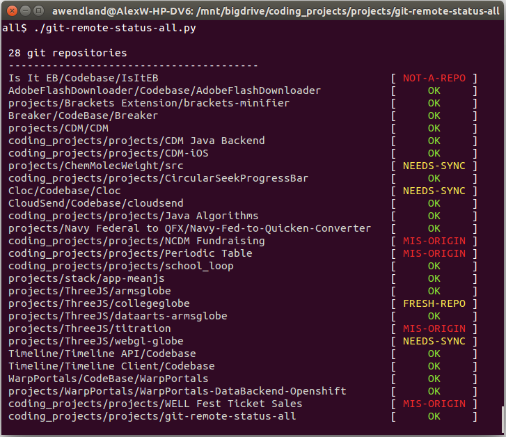

Git Remote Status All
=====================

Easy command to check the sync status of local git repositories with their remotes.

## Usage:

  1. Edit the 'repos' file to contain a newline separated list of paths to your repositories. These should point to the directory containing the '.git' folder, not the '.git' folder itself.
  2. Run 'python git-remote-status-all' or './git-remote-status-all' on Unix systems to execute the utility.

## Prereqs:

  * Python must be installed.
  * Git must be installed and in your system's path for this utility to work.

## Screenshot:

